# Digital Logic with TL-Verilog
> Combinational Logic, Sequential Circuits, Pipelined Design & Calculator Implementation on Makerchip

<h2>🔍 Overview</h2>

- Designed and simulated combinational and sequential digital logic circuits using TL-Verilog on the Makerchip platform — progressing from basic logic gates, vectors, and multiplexers to a fully pipelined calculator with validity control and single-value memory.
- Explored pipelining concepts, validity signals, and hierarchical design structures in TL-Verilog — building a strong foundation for RISC-V CPU pipeline design in subsequent sessions.

<h2>⚙️ Tasks Covered</h2>

| Task | Description |
|:---|:---|
| Makerchip Platform & Combinational Logic | Logic gates, vectors, mux, combinational calculator |
| Counter | Free-running sequential counter in TL-Verilog |
| Sequential Calculator | State retention, feedback loop, reset logic |
| Counter and Calculator in Pipeline | Multi-stage pipeline, 2-cycle calculator |
| Advanced Calculator Design Concepts | Validity control, single-value memory, hierarchy |

<h2>📝 Stage Details</h2>

**Task 1 — Makerchip Platform & Combinational Logic** &nbsp;|&nbsp; `Makerchip` `Gates` `Vectors` `Mux` `Calculator`

Explored the Makerchip IDE by loading the Pythagorean example and navigating diagrams and waveforms. Implemented basic combinational circuits — an inverter, a 2-input logic gate, a 5-bit vector, and a multiplexer. Built a combinational calculator supporting addition, subtraction, multiplication, and division on two random input values using a 4-way mux output selection.

**Task 2 — Counter** &nbsp;|&nbsp; `Sequential Logic` `Free-Running Counter` `TL-Verilog`

Designed a free-running counter in TL-Verilog that increments its value every clock cycle, demonstrating how sequential circuits maintain and update state. Explored a Fibonacci sequence generator reference example to deepen understanding of sequential feedback logic.

**Task 3 — Sequential Calculator** &nbsp;|&nbsp; `State Retention` `Feedback` `Reset` `Pipeline`

Extended the combinational calculator to a sequential design — `$val1` is fed back from the previous cycle's output, enabling the calculator to use its last result as the next input. Implemented reset logic to initialize the output to zero, and used a random operation selector to cycle through add, subtract, multiply, and divide operations each clock cycle.

**Task 4 — Counter and Calculator in Pipeline** &nbsp;|&nbsp; `Pipeline` `2-Cycle` `Validity` `|calc`

Integrated the calculator and counter into a single `|calc` pipeline at stage `@1`. Extended the design to a 2-cycle calculator — arithmetic operations at `@1`, output mux at `@2` — with a 1-bit counter toggling every cycle to generate the `$valid` signal, ensuring output is only produced every other cycle for high-frequency timing relief.

**Task 5 — Advanced Calculator Design Concepts** &nbsp;|&nbsp; `Validity` `Memory` `Recall` `Hierarchy`

Implemented a 2-cycle calculator with validity control using `$valid_or_reset` as the conditional for computation — avoiding unnecessary zeroing of `$out`. Extended `$op` to 3 bits and added a single-value memory MUX supporting `mem` (store) and `recall` (load) operations alongside the four arithmetic functions. Explored TL-Verilog's hierarchical design tutorial for modular code organization.

<h2>🖼️ Implementation Results</h2>

### Makerchip Platform & Combinational Logic
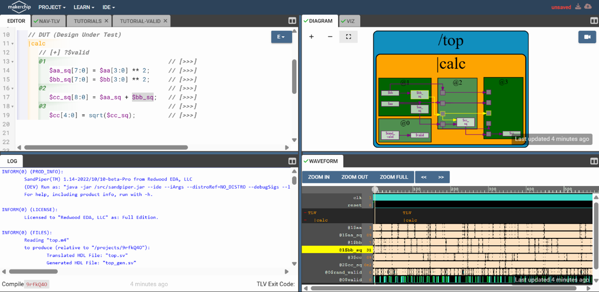
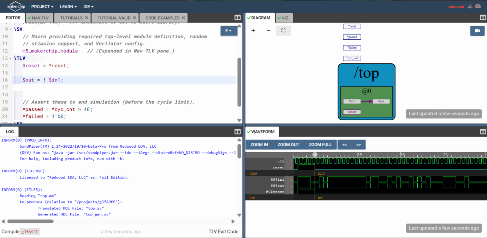
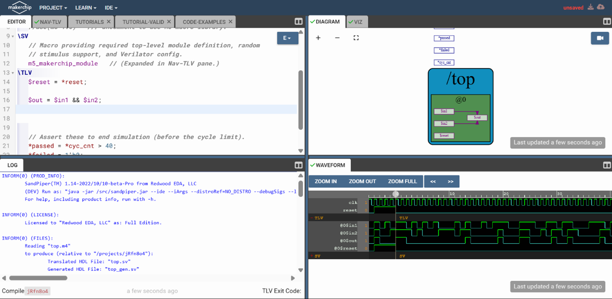

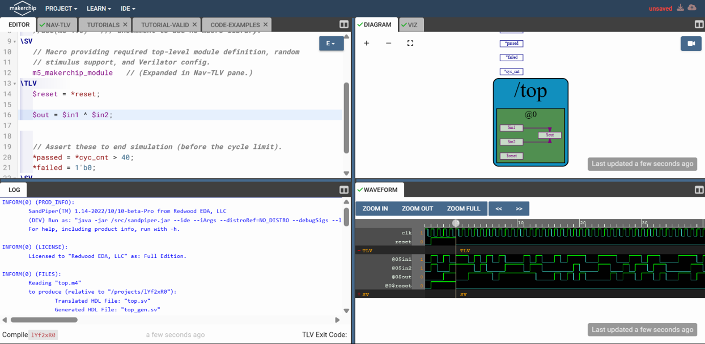
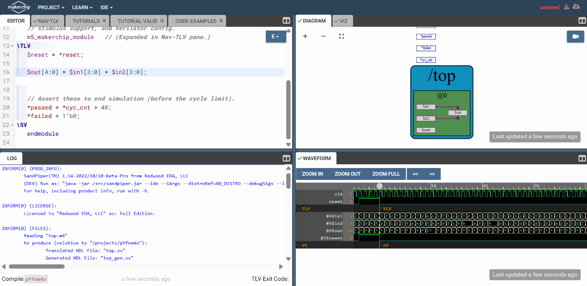
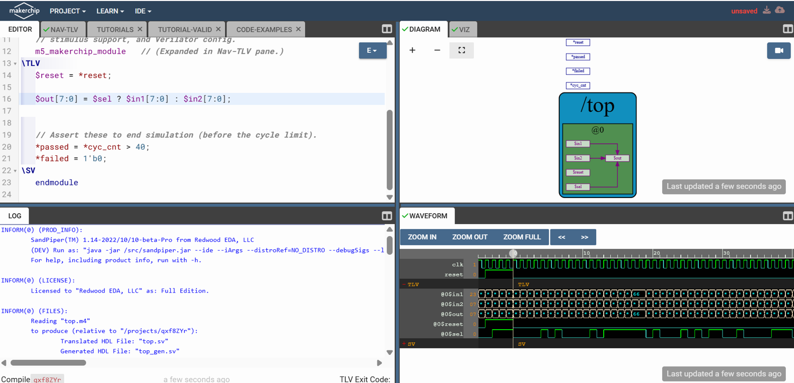
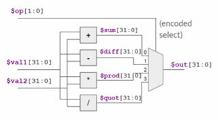
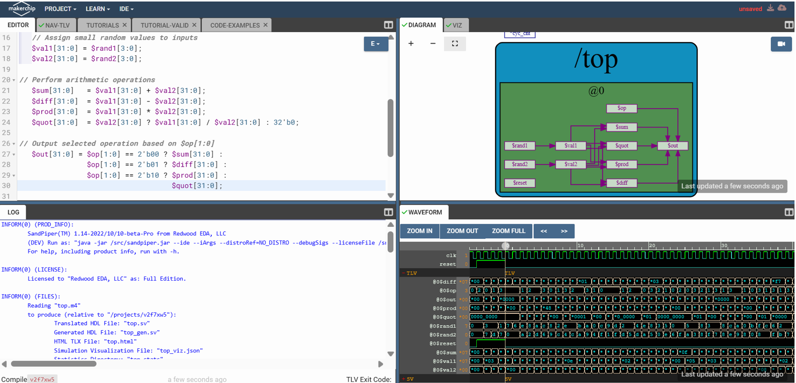

### Counter
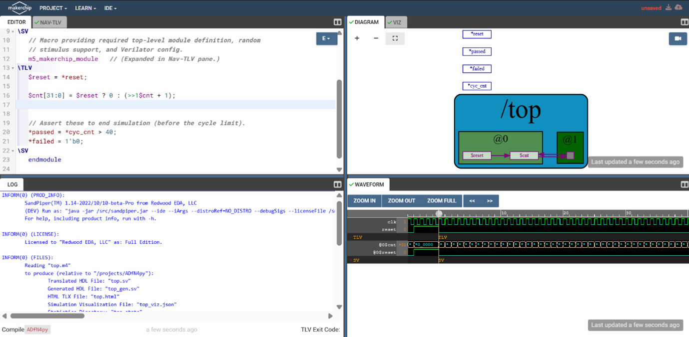

### Sequential Calculator
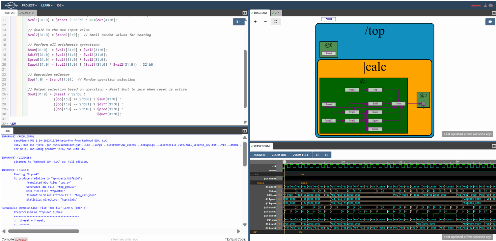

### Counter and Calculator in Pipeline
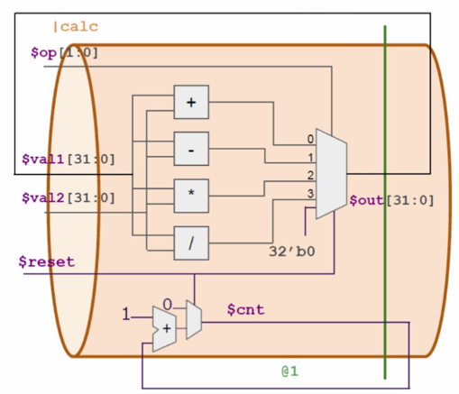
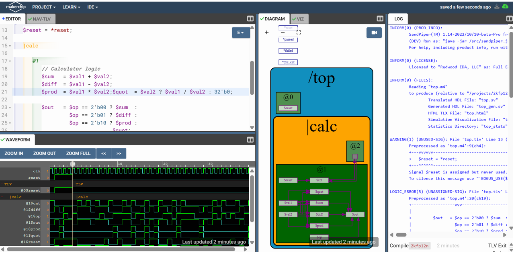
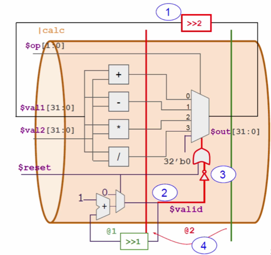
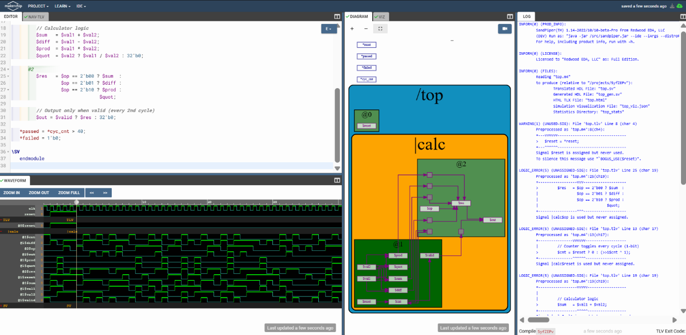

### Advanced Calculator Design Concepts
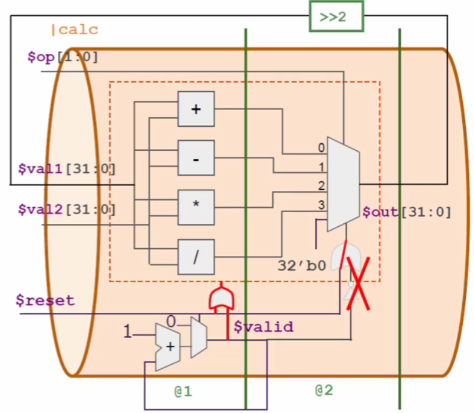
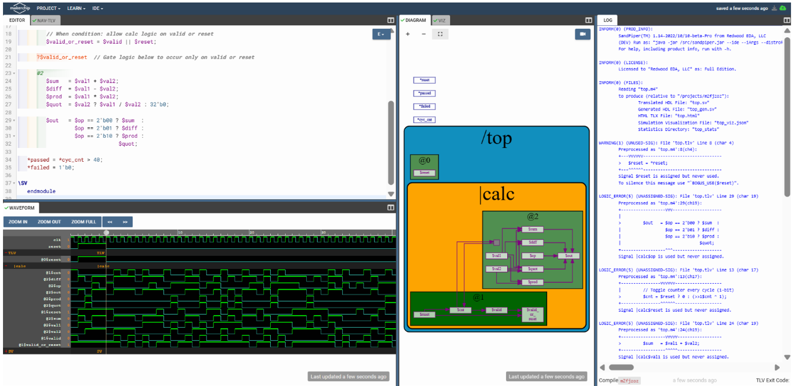
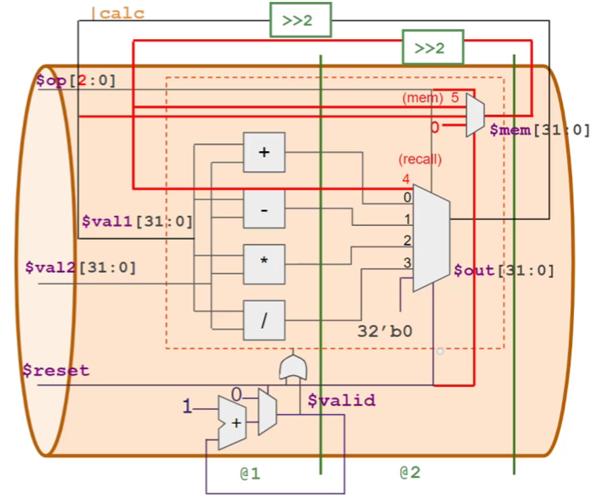
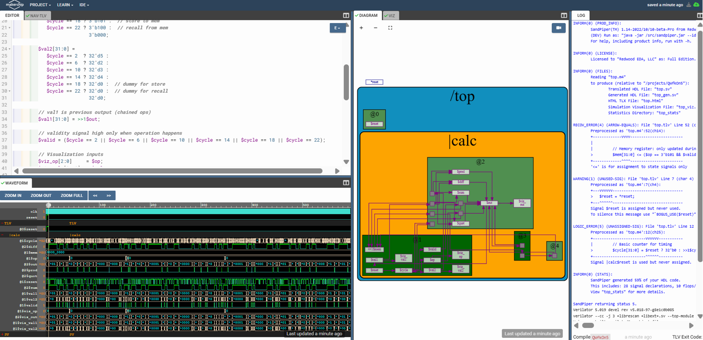
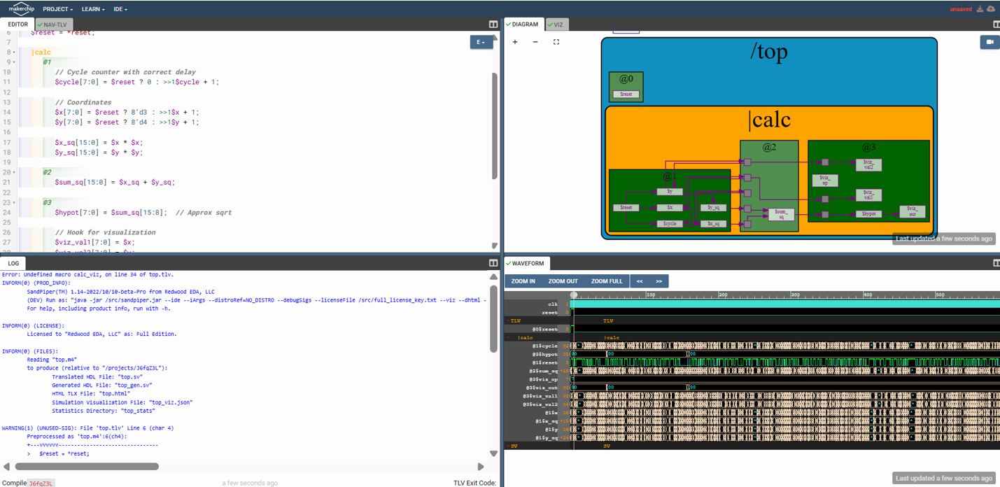

<h2>🔗 Navigation</h2>

[Back to Repository Overview](../README.md) &nbsp;|&nbsp; [Previous : 02 : ABI & Verification Flow](../02%20:%20ABI%20%26%20Verification%20Flow) &nbsp;|&nbsp; [Next : 04 : Basic RISC-V CPU](../04%20:%20Basic%20RISC-V%20CPU)
